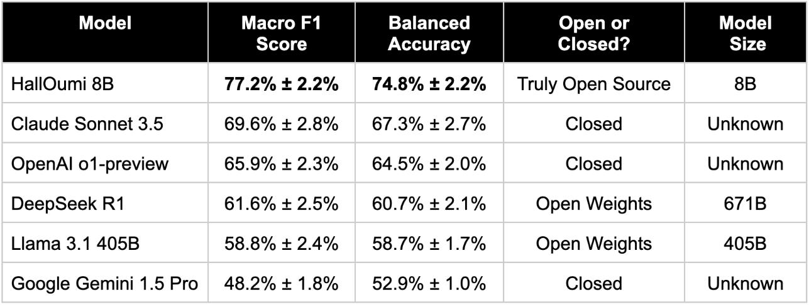

# HallOumi

We are excited to introduce HallOumi, a truly open-source claim verification (hallucination detection) model, outperforming Claude Sonnet, OpenAI o1, DeepSeek R1, Llama 405B, and Gemini Pro at only 8B parameters. For more details, please see our [blog post](https://oumi.ai/blog/posts/introducing-halloumi)!



To try it out (without installation), please visit our [web demo page](https://oumi.ai/halloumi-demo).

## 🛠 Setup
```bash
git clone https://github.com/oumi-ai/oumi.git
cd oumi/configs/projects/halloumi

pip install oumi
```

## ⚙️ Training
Example of Oumi fine-tuning:
```bash
# train HallOumi-8B
oumi train -c 8b_train.yaml

# train HallOumi-8B with GCP
oumi launch up -c configs/projects/halloumi/gcp_job.yaml --cluster halloumi-8b-sft
```

## 🚀 Prompt Formatting
To construct a prompt to query HallOumi, you will need the following:
- `context` (`str`): A context document that serves as the premise (or ground truth).
- `request` (`str`): A request or question to a language model.
- `response` (`str`): An AI-generated or human-created response, which may consist of one or multiple claims (hypotheses). The objective is to ground each claim to the provided `context`.

For optimal efficiency, HallOumi requires the `context` and `response` to be broken down to sentences, and the prompt to be formatted as follows:
```
<|context|>
  <|s1|><1st sentence of the context><end||s>
  <|s2|><2nd sentence of the context><end||s>
  ...
<end||context>

<|request|>
  <The question asked to the LLM.>
<end||request>

<|response|>
  <|r1|><The 1st claim/sentence of the LLM response><end||r>
  <|r1|><The 2nd claim/sentence of the LLM response><end||r>
  ...
<end||response>
```

<!-- FIXME: HF prompt formatting does not seem up-to-date: https://huggingface.co/datasets/oumi-ai/oumi-groundedness-benchmark -->

Code samples: Please see our inference notebook _(coming up soon!)_ <!-- TBA: Add link to generative HallOumi inference notebook (owner: Kostas) -->

## 🚀 Inference

### Local Inference

If you want to download HallOumi locally and run inference, please see our inference notebook.

Notebook for inference: _(coming up soon!)_ <!-- TBA: Add link to generative HallOumi inference notebook (owner: Kostas) -->

### Inference Server

If you want to create your own local inference server for HallOumi, please see our demo on GitHub:

https://github.com/oumi-ai/halloumi-demo


## 🚀 Evaluation
We have evaluated HallOumi’s performance against multiple state-of-the-art models, including DeepSeek R1, OpenAI o1, Google Gemini 1.5 Pro, Llama 3.1 405B, and Claude Sonnet 3.5, using Oumi's [Groundedness Benchmark](https://huggingface.co/datasets/oumi-ai/oumi-groundedness-benchmark).

We are releasing a notebook that demonstrates how to run end-to-end comparative evaluations, using Oumi's custom evaluation framework. The notebook details how, given the set of prompts, you can run inference, extract model predictions from free-form text model responses, and calculate any relevant metrics you want (e.g., F1 and Balanced Accuracy) for any closed or open source model (including HallOumi).

Notebook for evaluation: [Evaluating LLMs as Hallucination Classifiers](https://github.com/oumi-ai/oumi/blob/main/configs/projects/halloumi/halloumi_eval_notebook.ipynb)

## ❗️ License
This model is licensed under [Creative Commons NonCommercial (CC BY-NC 4.0)](https://creativecommons.org/licenses/by-nc/4.0/legalcode).

## 📖 Citation
If you use **HallOumi** in your research, please cite:
```
@misc{oumi2025HallOumi,
      title={HallOumi - a state-of-the-art claim verification model},
      author={Jeremiah Greer and Panos Achlioptas and Konstantinos Aisopos and Michael Schuler and Matthew Persons and Oussama Elachqar and Emmanouil Koukoumidis},
      year={2025},
      url={https://oumi.ai/halloumi},
}
```
